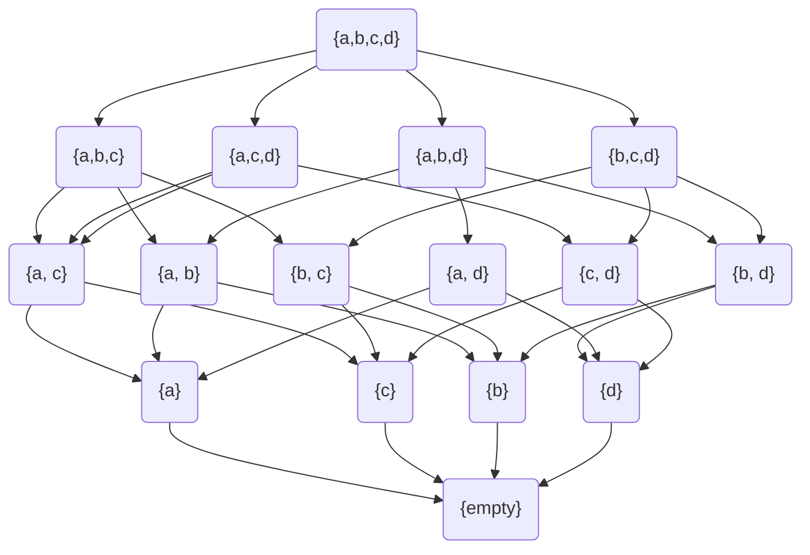
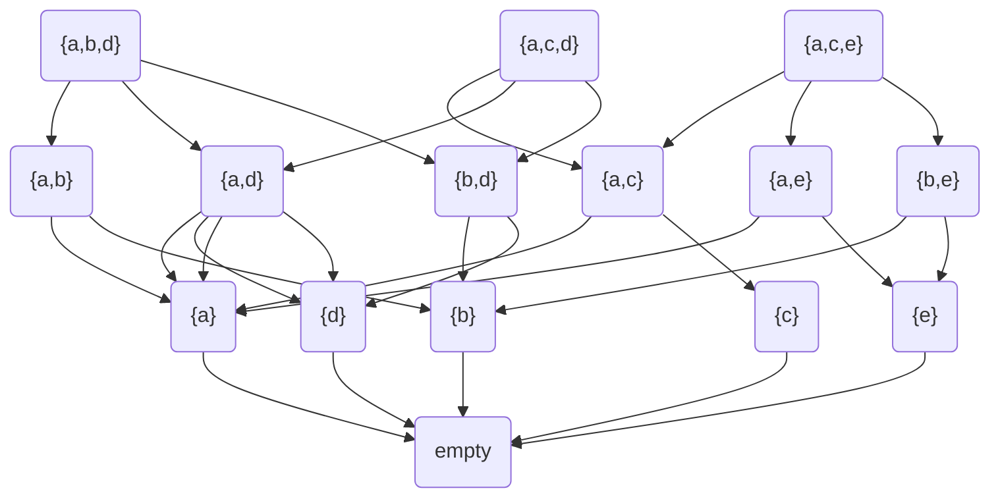
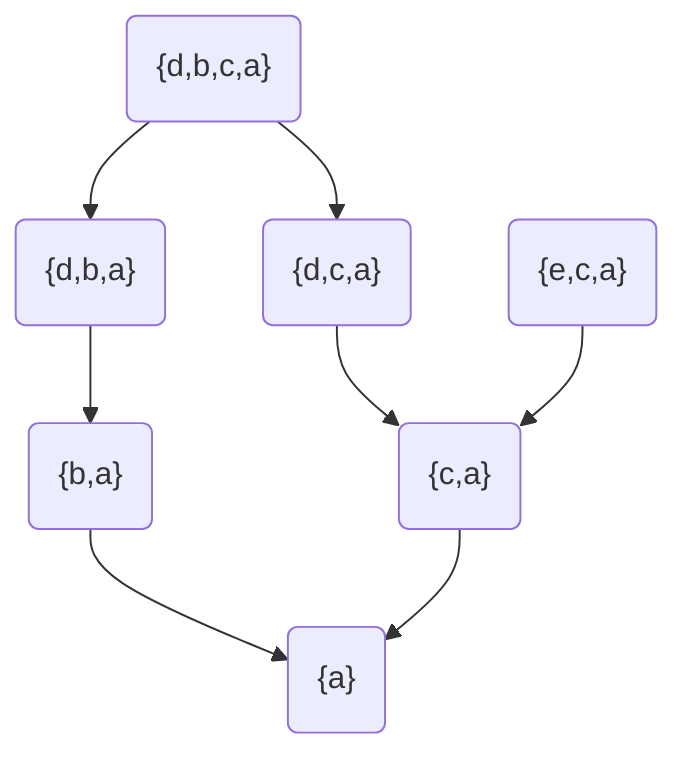

By a $partially ordered class$ we mean a pair of objects $\lang A, G\rang$

A is a $class$

G is an order relation in $A$

如果A是set，那就是$partially ordered set$，平平无奇

$x\leq y，(x, y)\in G$，$\lt$并不是order relation，而是strict order relation

---

[definition 4.1](#d_4_1)

Let A and B be partially ordered classes; by the lexicographic ordering of $A\times B$; we mean the following order relation in $A\times B$:

If $(a_1,b_1)\in A\times B$ and $(a_2, b_2)\in A\times B$, then we let $(a_1,b_1)\leq (a_2,b_2)$ if and only if

i) $a_1\lt a_2$ or

ii) $a_1=a_2\ and\ b_1 \leq b_2$

这就是字典排序的方法

---

[definition 4.2](#d_4_2)

反字典排序，只是先比较b，后比较a而已

---

[definition 4.3](#d_4_3)

Let A be a partially ordered class. Two elements x and y in A are said to be $comparable$ if either $x\leq y$ or $y\leq x$; otherwise, they are said to be $imcomparable$

---

[definition 4.4](#d_4_4)

Let A be a partially ordered class, and let B be an arbitrary subclass of A. If every two elements of B are comparable, then we call B a $fully\ ordered\ subclass$ of A, or a $linearly\ ordered$ subclass of A, or, more commonly, a $chain$ of A.

这就是为什么加一个$partially$的原因，因为不是任意在A中的两个元素都可以进行比较

---

[definition 4.5](#d_4_5)

Let A be a partially ordered class and suppose $a \in A$. The $initial\ segment\ of\ A\ determined\ by\ a$ is the class $S_a$, defined as follows:

$S_a=\{x\in A: x\lt a\}$

---

[Theorem 4.6](#t_4_6)

Let A be a partially ordered class. If P is an initial segment of A, and Q is an initial segment of P, then Q is an initial segment of A.

易证

---

[definition 4.7](#d_4_7)

If A is a partially ordered class, then a $cut$ of A is pair $(L, U)$ of nonempty subclasses of A with the following properties:

i) $L\cap U=\empty\ and\ L\cup U = A$

ii) If $x\in L$ and $y\leq x$, then $y\in L$

iii) If $x\in U$ and $y\geq x$, then $y\in U$

---

数学中最重要的排序关系是$\subseteq$

## exercise 

### 4.1.1

### 4.1.2

all chains: $\rho(\{d, b, c\})$, $\rho(\{d,c,a\})$, $\rho(\{e,c,a\})$

$\{a,b,d\},\{a, b\},\{a,d\},\{b,d\},\{a\},\{b\},\{d\}$

$\{a,c,d\},\{a, c\},\{a,d\},\{c,d\},\{a\},\{c\},\{d\}$

$\{a,c,e\},\{a, c\},\{a,e\},\{c,e\},\{a\},\{c\},\{e\}$

all the initial segments: 选出一个元素a，找出元素x，$x\leq a$，集合的所有子集即是$initial\ segments$

d: $\{d, b, c, a\}$

b: $\{b, a\}$

c: $\{c, a\}$

a: $\{a\}$

e: $\{e, c, a\}$ 加上这个集合的子集

all the cuts of A: 同上方法，只是需要多找出元素x，$x\geq a$

对五个元素假设该元素在U中，那么所有大于该元素的元素都应该在U中，再判断能否保证L和U的属性

e: $U=\{e\}, L=\{b,c,a\}$，d随意在L或者U中

d: $U=\{d\}, L=\{b,c,a\}$，e随意在L或者U中，e在L中并不违背L的定义

b: $U=\{b,d\},L=\{a,c,e\}$

c: $U=\{c,d,e\},L=\{b,a\}$

a: $U=\{c,b,d,e\}, L=\{a\}$

### 4.1.3

显然the class of all chains是一个partially ordered class

the class of all initial segments

### 4.1.4

任意在$C\times D$两个元素都属于$A\times B$，因为两个元素在$A\times B$按字典顺序排列，所以自然在$C\times B$中排列

### 4.1.5

$A\times L \cap A\times U = \empty$显而易见

$(x,y) \in A\times L \lor A\times U$

$x\in A, y\in L\cup U$

$(x, y)\in A\times B$反之已证

所以$(A\times L, A\times U)$满足交集并集特性

$(x_0, y_0)\in A\times L, \forall (x, y) \in A\times B \leq (x_0, y_0), y_0 \leq y \lor (x_0\leq x \land y_0 = y)$

$(x, y)\in A\times L$

同理可证U的性质

### 4.1.6

证明H是order relation

reflexive

$\forall x \in A, (G_x, G_x), \exists x, x\leq x$显然成立

antisymmetric

$(G_x, G_y)\in H, \forall w\in G_x, \exists z\in G_y, w\leq z$

如果$(G_y, G_x)\in H$

则$\forall w\in G_y, \exists z\in G_x, w\leq z$

则必定找到$w=z$，$G_x = G_y$

transitive

$(G_x, G_y)\in H \land (G_y, G_z)\in H$

$\forall a \in G_x, \exists b\in G_y, a\leq b, \exists c\in G_z, a\leq z$

$(G_x, G_z)\in H$